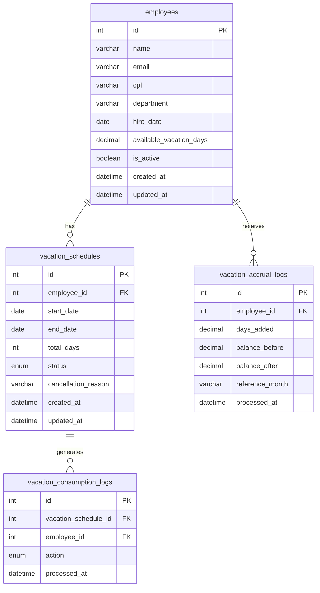
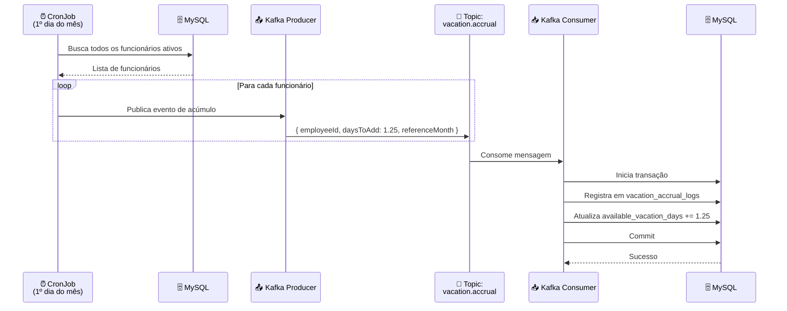
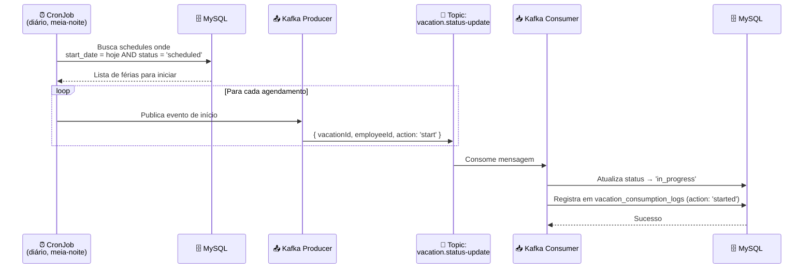
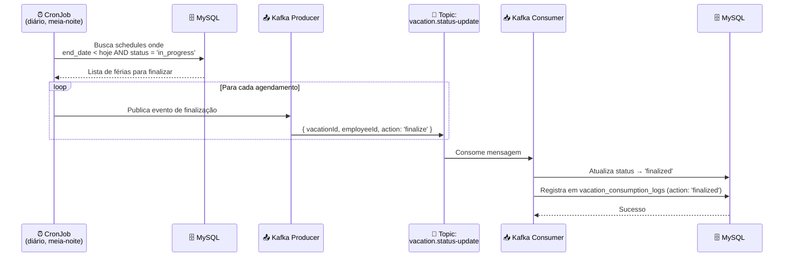
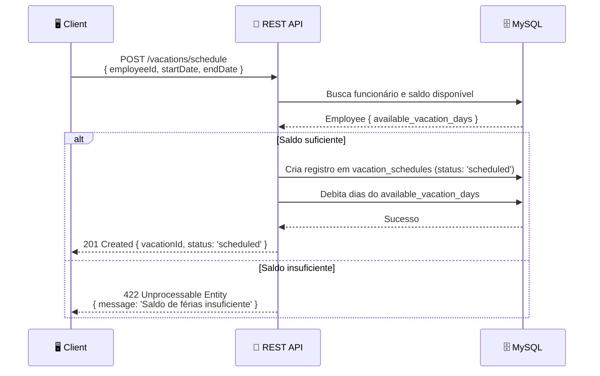

# 🏖️ Vacation Management System

Sistema de gerenciamento de férias para funcionários, desenvolvido com NestJS, MySQL e Kafka.

---

## 📋 Visão Geral

O sistema permite o controle completo do ciclo de férias dos funcionários: desde o cadastro, acúmulo automático mensal de dias, agendamento e acompanhamento do status das férias em tempo real.

---

## 🚀 Stack Tecnológica

| Camada | Tecnologia |
|---|---|
| Framework | NestJS |
| Banco de Dados | MySQL |
| Fila de Mensagens | Apache Kafka |
| Agendamento | NestJS Schedule (cron) |
| ORM | TypeORM |

---

## 🏗️ Arquitetura de Módulos

```
src/
├── employees/          # CRUD de funcionários
├── vacations/          # Agendamento e acompanhamento de férias
├── accrual/            # Lógica de acúmulo mensal
├── kafka/              # Producers e Consumers
│   ├── producers/
│   └── consumers/
├── scheduler/          # Cron jobs
└── database/           # Configuração MySQL / TypeORM
```

---

## 🗄️ Diagrama do Banco de Dados



> **Enum `status`** em `vacation_schedules`: `scheduled` | `in_progress` | `finalized` | `canceled`

> **Enum `action`** em `vacation_consumption_logs`: `started` | `finalized`

---

## 🔄 Fluxos com Kafka e Cron

### 1. Acúmulo Mensal de Férias

Todo mês, no primeiro dia, o sistema dispara um cron job que publica um evento no Kafka para cada funcionário ativo. O consumer processa a mensagem e adiciona **1.25 dias** ao saldo disponível.



---

### 2. Início Automático das Férias (scheduled → in_progress)

Um cron job diário verifica se há férias com `start_date = hoje` e status `scheduled`, publicando eventos para iniciar cada período.



---

### 3. Finalização Automática das Férias (in_progress → finalized)

Outro cron job diário verifica se há férias com `end_date = ontem` e status `in_progress`, publicando eventos para finalizá-las.



---

### 4. Agendamento de Férias (fluxo síncrono via API)



---

## 📡 Tópicos Kafka

| Tópico | Publicado por | Consumido por | Descrição |
|---|---|---|---|
| `vacation.accrual` | AccrualCronJob | AccrualConsumer | Acúmulo mensal de 1.25 dias |
| `vacation.status-update` | StatusCronJob | StatusConsumer | Transições de status (start / finalize) |

---

## 🔌 Endpoints da API

### Funcionários
| Método | Rota | Descrição |
|---|---|---|
| `GET` | `/employees` | Lista todos os funcionários |
| `GET` | `/employees/:id` | Busca funcionário por ID |
| `POST` | `/employees` | Cria novo funcionário |
| `PATCH` | `/employees/:id` | Atualiza funcionário |
| `DELETE` | `/employees/:id` | Remove (soft delete) funcionário |

### Férias
| Método | Rota | Descrição |
|---|---|---|
| `POST` | `/vacations/schedule` | Agenda férias |
| `PATCH` | `/vacations/:id/cancel` | Cancela férias agendadas |
| `GET` | `/vacations/employee/:id` | Lista histórico de férias do funcionário |
| `GET` | `/vacations/:id` | Busca detalhe de um agendamento |

---

## ⏰ Cron Jobs

| Job | Expressão Cron | Ação |
|---|---|---|
| `AccrualCronJob` | `0 0 1 * *` | Publica acúmulo de 1.25 dias para todos os funcionários ativos no 1º dia de cada mês |
| `VacationStartCronJob` | `0 0 * * *` | Publica início de férias agendadas para hoje |
| `VacationEndCronJob` | `0 0 * * *` | Publica finalização de férias cujo período encerrou |

---

## 🛡️ Regras de Negócio

- Funcionário só pode agendar férias se tiver saldo suficiente de dias disponíveis (`total_days <= available_vacation_days`).
- O cancelamento só é permitido para férias com status `scheduled`. Ao cancelar, os dias são devolvidos ao saldo.
- Férias com status `in_progress` ou `finalized` não podem ser canceladas.
- O acúmulo mensal considera apenas funcionários com `is_active = true`.
- Não é permitido agendar períodos sobrepostos para o mesmo funcionário.

---

## 🚦 Máquina de Estados — Status das Férias

```
scheduled ──► in_progress ──► finalized
    │
    └──► canceled
```

| Transição | Gatilho |
|---|---|
| `scheduled → in_progress` | CronJob diário (data de início atingida) |
| `in_progress → finalized` | CronJob diário (data de término ultrapassada) |
| `scheduled → canceled` | Requisição manual via API |

---

## ⚙️ Variáveis de Ambiente

```env
# Database
DB_HOST=localhost
DB_PORT=3306
DB_USER=root
DB_PASS=secret
DB_NAME=vacation_management

# Kafka
KAFKA_BROKERS=localhost:9092
KAFKA_CLIENT_ID=vacation-service
KAFKA_GROUP_ID=vacation-consumer-group

# App
PORT=3000
```

---

## 🐳 Como rodar localmente

```bash
# Subir dependências (MySQL + Kafka + Zookeeper)
docker-compose up -d

# Instalar dependências
npm install

# Rodar migrations
npm run migration:run

# Iniciar aplicação
npm run start:dev
```
