# 🏖️ Vacation Management System

Employee vacation management system built with NestJS, MySQL, and Kafka.

---

## 📋 Overview

The system enables complete control over the employee vacation lifecycle: from registration, automatic monthly day accrual, scheduling, and real-time status tracking.

---

## 🚀 Tech Stack

| Layer | Technology |
|---|---|
| Framework | NestJS |
| Database | MySQL |
| Message Queue | Apache Kafka |
| Scheduling | NestJS Schedule (cron) |
| ORM | TypeORM |

---

## 🏗️ Module Architecture

```
src/
├── employees/          # Employee CRUD
├── vacations/          # Vacation scheduling and tracking
├── accrual/            # Monthly accrual logic
├── kafka/              # Producers and Consumers
│   ├── producers/
│   └── consumers/
├── scheduler/          # Cron jobs
└── database/           # MySQL / TypeORM configuration
```

---

## 🗄️ Database Diagram


> **Enum `status`** in `vacation_schedules`: `scheduled` | `in_progress` | `finalized` | `canceled`

> **Enum `action`** in `vacation_consumption_logs`: `started` | `finalized`

---

## 🔄 Kafka and Cron Flows

### 1. Monthly Vacation Accrual

On the first day of every month, a cron job fires and publishes a Kafka event for each active employee. The consumer processes the message and adds **1.25 days** to the available balance.

```mermaid
sequenceDiagram
    participant Cron as ⏰ CronJob<br/>(1st of the month)
    participant DB1 as 🗄️ MySQL
    participant Producer as 📤 Kafka Producer
    participant Topic as 📨 Topic:<br/>vacation.accrual
    participant Consumer as 📥 Kafka Consumer
    participant DB2 as 🗄️ MySQL

    Cron->>DB1: Fetch all active employees
    DB1-->>Cron: Employee list

    loop For each employee
        Cron->>Producer: Publish accrual event
        Producer->>Topic: { employeeId, daysToAdd: 1.25, referenceMonth }
    end

    Topic->>Consumer: Consume message
    Consumer->>DB2: Begin transaction
    Consumer->>DB2: Insert into vacation_accrual_logs
    Consumer->>DB2: Update available_vacation_days += 1.25
    Consumer->>DB2: Commit
    DB2-->>Consumer: Success
```



---

### 2. Automatic Vacation Start (scheduled → in_progress)

A daily cron job checks for vacations with `start_date = today` and status `scheduled`, publishing events to start each period.

```mermaid
sequenceDiagram
    participant Cron as ⏰ CronJob<br/>(daily, midnight)
    participant DB1 as 🗄️ MySQL
    participant Producer as 📤 Kafka Producer
    participant Topic as 📨 Topic:<br/>vacation.status-update
    participant Consumer as 📥 Kafka Consumer
    participant DB2 as 🗄️ MySQL

    Cron->>DB1: Fetch schedules where<br/>start_date = today AND status = 'scheduled'
    DB1-->>Cron: List of vacations to start

    loop For each schedule
        Cron->>Producer: Publish start event
        Producer->>Topic: { vacationId, employeeId, action: 'start' }
    end

    Topic->>Consumer: Consume message
    Consumer->>DB2: Update status → 'in_progress'
    Consumer->>DB2: Insert into vacation_consumption_logs (action: 'started')
    DB2-->>Consumer: Success
```



---

### 3. Automatic Vacation Finalization (in_progress → finalized)

Another daily cron job checks for vacations with `end_date = yesterday` and status `in_progress`, publishing events to finalize them.

```mermaid
sequenceDiagram
    participant Cron as ⏰ CronJob<br/>(daily, midnight)
    participant DB1 as 🗄️ MySQL
    participant Producer as 📤 Kafka Producer
    participant Topic as 📨 Topic:<br/>vacation.status-update
    participant Consumer as 📥 Kafka Consumer
    participant DB2 as 🗄️ MySQL

    Cron->>DB1: Fetch schedules where<br/>end_date < today AND status = 'in_progress'
    DB1-->>Cron: List of vacations to finalize

    loop For each schedule
        Cron->>Producer: Publish finalization event
        Producer->>Topic: { vacationId, employeeId, action: 'finalize' }
    end

    Topic->>Consumer: Consume message
    Consumer->>DB2: Update status → 'finalized'
    Consumer->>DB2: Insert into vacation_consumption_logs (action: 'finalized')
    DB2-->>Consumer: Success
```



---

### 4. Vacation Scheduling (synchronous flow via API)

```mermaid
sequenceDiagram
    participant Client as 🖥️ Client
    participant API as 🔌 REST API
    participant DB as 🗄️ MySQL

    Client->>API: POST /vacations/schedule<br/>{ employeeId, startDate, endDate }
    API->>DB: Fetch employee and available balance
    DB-->>API: Employee { available_vacation_days }

    alt Sufficient balance
        API->>DB: Create record in vacation_schedules (status: 'scheduled')
        API->>DB: Deduct days from available_vacation_days
        DB-->>API: Success
        API-->>Client: 201 Created { vacationId, status: 'scheduled' }
    else Insufficient balance
        API-->>Client: 422 Unprocessable Entity<br/>{ message: 'Insufficient vacation balance' }
    end
```



---

## 📡 Kafka Topics

| Topic | Published by | Consumed by | Description |
|---|---|---|---|
| `vacation.accrual` | AccrualCronJob | AccrualConsumer | Monthly accrual of 1.25 days |
| `vacation.status-update` | StatusCronJob | StatusConsumer | Status transitions (start / finalize) |

---

## 🔌 API Endpoints

### Employees
| Method | Route | Description |
|---|---|---|
| `GET` | `/employees` | List all employees |
| `GET` | `/employees/:id` | Get employee by ID |
| `POST` | `/employees` | Create new employee |
| `PATCH` | `/employees/:id` | Update employee |
| `DELETE` | `/employees/:id` | Remove employee (soft delete) |

### Vacations
| Method | Route | Description |
|---|---|---|
| `POST` | `/vacations/schedule` | Schedule vacation |
| `PATCH` | `/vacations/:id/cancel` | Cancel scheduled vacation |
| `GET` | `/vacations/employee/:id` | List employee vacation history |
| `GET` | `/vacations/:id` | Get schedule details |

---

## ⏰ Cron Jobs

| Job | Cron Expression | Action |
|---|---|---|
| `AccrualCronJob` | `0 0 1 * *` | Publishes 1.25-day accrual for all active employees on the 1st of each month |
| `VacationStartCronJob` | `0 0 * * *` | Publishes start event for vacations scheduled for today |
| `VacationEndCronJob` | `0 0 * * *` | Publishes finalization event for vacations whose period has ended |

---

## 🛡️ Business Rules

- An employee can only schedule vacation if they have a sufficient available day balance (`total_days <= available_vacation_days`).
- Cancellation is only allowed for vacations with status `scheduled`. Upon cancellation, the days are returned to the balance.
- Vacations with status `in_progress` or `finalized` cannot be canceled.
- Monthly accrual only applies to employees with `is_active = true`.
- Overlapping periods for the same employee are not allowed.

---

## 🚦 State Machine — Vacation Status

```
scheduled ──► in_progress ──► finalized
    │
    └──► canceled
```

| Transition | Trigger |
|---|---|
| `scheduled → in_progress` | Daily CronJob (start date reached) |
| `in_progress → finalized` | Daily CronJob (end date passed) |
| `scheduled → canceled` | Manual request via API |

---

## ⚙️ Environment Variables

```env
# Database
DATABASE_HOST=localhost
DATABASE_PORT=3306
DATABASE_USER=root
DATABASE_PASSWORD=<secret>
DATABASE_NAME=vacation_management

# Kafka
KAFKA_BROKERS=localhost:9092
KAFKA_CLIENT_ID=vacation-service
KAFKA_GROUP_ID=vacation-consumer-group

# App
PORT=3000
```

---

## 🐳 Running Locally

```bash
# Start dependencies (MySQL + Kafka + Zookeeper)
docker-compose up -d

# Install dependencies
npm install

# Run migrations
npm run migration:run

# Start the application
npm run start:dev
```
